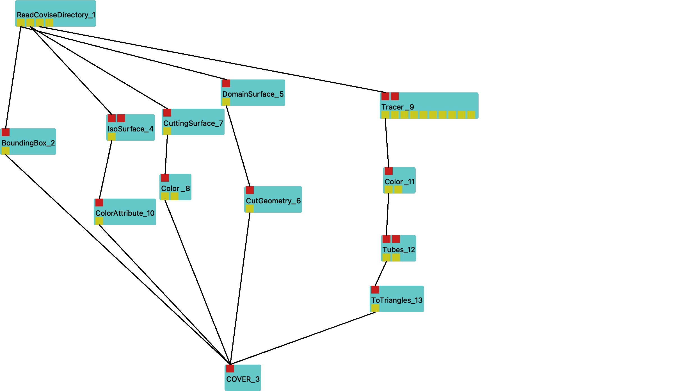
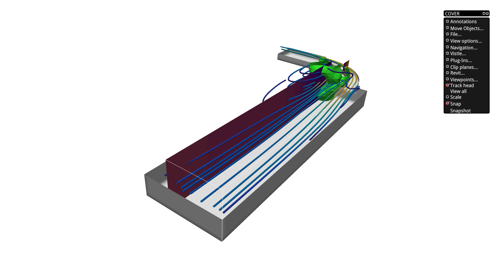

# BoundingBox
Compute bounding boxes
## Description

The BoundingBox module takes its geometry input from `grid_in` and finds global minimum and maximum
values for its coordinates. The result of this process can be seen in its parameter window as the
values of the `min` and `max` parameters. The location of the extremal values are recorded in its
other output parameters. It also provides a tight axis-aligned cuboid around the domain of the data
at the `grid_out` output. By enabling `per_block`, it creates an enclosing cuboid for each input
block individually instead of for all blocks globally.

The bounding box can be used as a rough guide to the interesting areas of the dat set. The box can
also provide visual clues that help with orientation in 3D space. Showing bounding boxes for
individual blocks will allow you to assess the partitioning of your data. The numerical values can
be used to craft input for modules requiring coordinates as parameter input.

## Usage Examples

Workflow for reading scalar and vector fields and drawing a bounding box around the domain of the data

Rendering of visualization with a enclosing bounding box

<svg width="2214.0" height="210" >

<rect x="0" y="60" width="221.39999999999998" height="90" rx="5" ry="5" style="fill:#64c8c8ff;" />
<rect x="6.0" y="60" width="30" height="30" rx="0" ry="0" style="fill:#c81e1eff;" >
<title>grid_in</title></rect>
<rect x="21.0" y="30" width="1.0" height="30" rx="0" ry="0" style="fill:#000000;" />
<rect x="21.0" y="30" width="30" height="1.0" rx="0" ry="0" style="fill:#000000;" />
<text x="57.0" y="33.0" class="text" >input data<tspan> (grid_in)</tspan></text>
<rect x="6.0" y="120" width="30" height="30" rx="0" ry="0" style="fill:#c8c81eff;" >
<title>grid_out</title></rect>
<rect x="21.0" y="150" width="1.0" height="30" rx="0" ry="0" style="fill:#000000;" />
<rect x="21.0" y="180" width="30" height="1.0" rx="0" ry="0" style="fill:#000000;" />
<text x="57.0" y="183.0" class="text" >bounding box<tspan> (grid_out)</tspan></text>
<text x="6.0" y="115.5" class="moduleName" >BoundingBox</text></svg>

## Parameters
|name|description|type|
|-|-|-|
|per_block|create bounding box for each block|Int|
|min|output parameter: minimum|Vector|
|max|output parameter: maximum|Vector|
|min_block|output parameter: block numbers containing minimum|IntVector|
|max_block|output parameter: block numbers containing maximum|IntVector|
|min_index|output parameter: indices of minimum|IntVector|
|max_index|output parameter: indices of maximum|IntVector|
