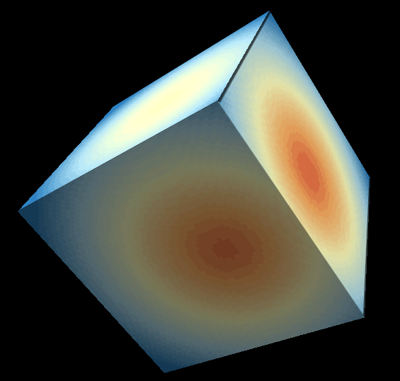

# SenseiController
acquire data from SENSEI instrumented simulations
This module is used to connect to a simulation via the SENSEI in-situ interface.
Depending on the connected ports and the frequency parameter the module requests data from the simulation.
Once the simulation generates the requested data the module is automatically executed.

## Parameters
|name|description|type|
|-|-|-|
|path|path to the connection file written by the simulation|String|
|frequency|the pipeline is processed for every nth simulation cycle|Int|
|keep timesteps|if true timesteps are cached and processed as time series|Int|

simulation specific commands
----------------------------
connected simulations might provide additional commands that are (for now) represented by parameters. Changing one of these parameters triggers the displayed action in the simulation, the actual value of these parameters is meaningless.

Oscillator Example (multi-process vistle)
------------------------------------------
- checkout git@github.com:hpcdgrie/sensei.git and build SENSEI with the ENABLE_VISTLE CMake flag
- start the simulation: *path to SENSEI build*/bin/oscillator -f ../../configs/oscillatorVistle.xml ../../miniapps/oscillators/inputs/sample.osc
- start vistle and load oscillatorExample.vsl

- click on the run/paused parameter of this module to start/pause the simulation. The rusults should look like the following image:

<svg width="102.8em" height="4.6em" >

<rect x="0em" y="0.8em" width="10.28em" height="3.0em" rx="0.1em" ry="0.1em" style="fill:#64c8c8ff;" />
<text x="0.2em" y="2.6500000000000004em" class="moduleName" >SenseiController</text></svg>
