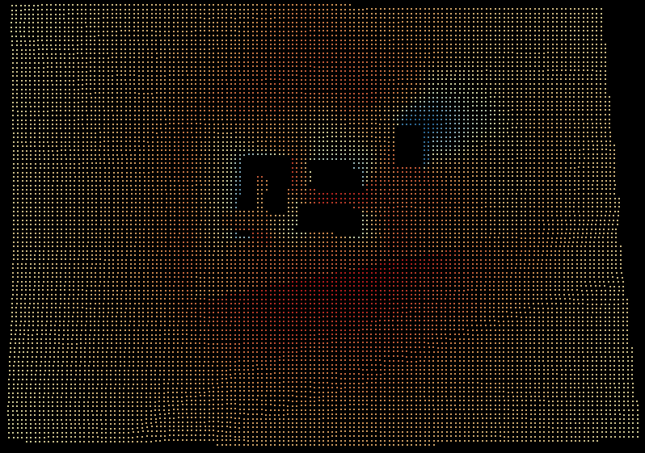

# ReadSoundPlan
Read SoundPLAN files.

## Purpose

ReadSoundPlan is able to read the result of a sound simulation generated by the open source multiphysical simulation software [SoundPLAN](https://www.soundplan.eu/de/software/).

## Files

The simulation results must be avaible in the following form as txt file to be readable for the reader.

```
X		Y		Z	    W	    LrT	    LrN	    LT,max	LN,max
3507180,000	5399925,000	456,16	462,2	33,9	30,3	0,0	0,0
3507185,000	5399925,000	456,11	462,1	34,0	30,4	0,0	0,0
...
```

---

## Ports

<svg width="85.39999999999999em" height="7.6em" >
<style>.text { font: normal 1.0em sans-serif;}tspan{ font: italic 1.0em sans-serif;}.moduleName{ font: bold 1.0em sans-serif;}</style>
<rect x="0em" y="0.8em" width="8.54em" height="3.0em" rx="0.1em" ry="0.1em" style="fill:#64c8c8ff;" />
<text x="0.2em" y="2.6500000000000004em" class="moduleName" >ReadSoundPlan</text><rect x="0.2em" y="2.8em" width="1.0em" height="1.0em" rx="0.0em" ry="0.0em" style="fill:#c8c81eff;" >
<title>Mesh</title></rect>
<rect x="0.7em" y="3.8em" width="0.03333333333333333em" height="3.0em" rx="0.0em" ry="0.0em" style="fill:#000000;" />
<rect x="0.7em" y="6.8em" width="1.0em" height="0.03333333333333333em" rx="0.0em" ry="0.0em" style="fill:#000000;" />
<text x="1.9em" y="6.8999999999999995em" class="text" >Points (point data)<tspan> (Mesh)</tspan></text>
<rect x="1.4em" y="2.8em" width="1.0em" height="1.0em" rx="0.0em" ry="0.0em" style="fill:#c8c81eff;" >
<title>Daysound</title></rect>
<rect x="1.9em" y="3.8em" width="0.03333333333333333em" height="2.0em" rx="0.0em" ry="0.0em" style="fill:#000000;" />
<rect x="1.9em" y="5.8em" width="1.0em" height="0.03333333333333333em" rx="0.0em" ry="0.0em" style="fill:#000000;" />
<text x="3.0999999999999996em" y="5.8999999999999995em" class="text" >Float (daysound)<tspan> (Daysound)</tspan></text>
<rect x="2.5999999999999996em" y="2.8em" width="1.0em" height="1.0em" rx="0.0em" ry="0.0em" style="fill:#c8c81eff;" >
<title>Nightsound</title></rect>
<rect x="3.0999999999999996em" y="3.8em" width="0.03333333333333333em" height="1.0em" rx="0.0em" ry="0.0em" style="fill:#000000;" />
<rect x="3.0999999999999996em" y="4.8em" width="1.0em" height="0.03333333333333333em" rx="0.0em" ry="0.0em" style="fill:#000000;" />
<text x="4.3em" y="4.8999999999999995em" class="text" >Float (nightsound)<tspan> (Nightsound)</tspan></text>
</svg>

The first port providing points. The following ports showing the scalar results for different times of day.


## Parameters
|name|description|type|
|-|-|-|
|first_step|first timestep to read|Int|
|last_step|last timestep to read (-1: last)|Int|
|step_increment|number of steps to increment|Int|
|first_rank|rank for first partition of first timestep|Int|
|check_convexity|whether to check convexity of grid cells|Int|
|Filename|SoundPLAN data file path|String|

### Important to note

The reader operates only on the master node, because it haven't been parallelized yet.

## Example Usage

In the simplest and most cases a visualization of the simulation result can be done like shown in figure 1. 

```{figure} ../../../module/read/ReadSoundPlan/soundplan.png
---
align: center
width: 150px
---
Fig 1: Simple vizualization pipeline.
```

The [Color](Color.md) module maps scalar data onto the points/surface. The [DelaunayTriangulator](DelaunayTriangulator.md) is used here to convert the points into a surface in XY coordinates. As a result the visualization could look like the following picture. 


Without the triangulator the picture would look like



## Related Modules

### Often Used With

- [DelaunayTriangulator](DelaunayTriangulator.md)
- [Color](Color.md)
