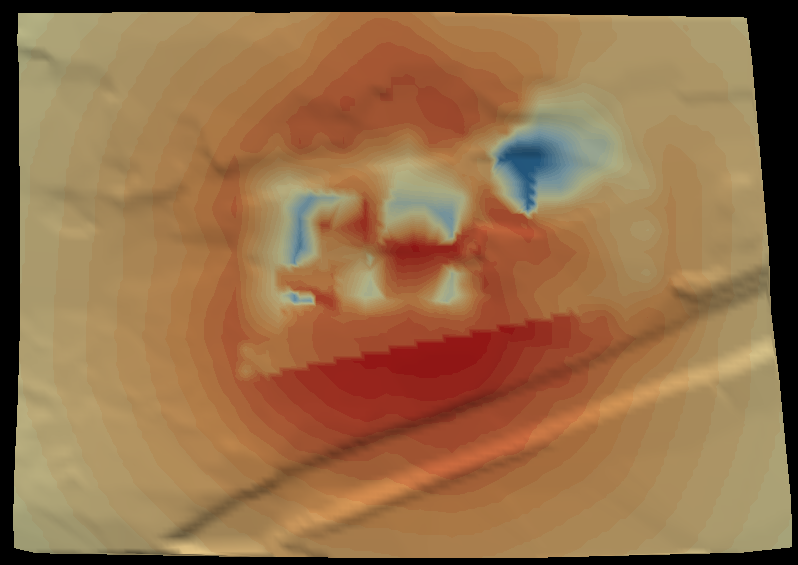

[headline]:<>

## Purpose

ReadSoundPlan is able to read the result of a sound simulation generated by the open source multiphysical simulation software [SoundPLAN](https://www.soundplan.eu/de/software/).

## Files

The simulation results must be avaible in the following form as txt file to be readable for the reader.

```
X		Y		Z	    W	    LrT	    LrN	    LT,max	LN,max
3507180,000	5399925,000	456,16	462,2	33,9	30,3	0,0	0,0
3507185,000	5399925,000	456,11	462,1	34,0	30,4	0,0	0,0
...
```

---

## Ports
[moduleHtml]:<>

The first port providing points. The following ports showing the scalar results for different times of day.

[parameters]:<>

### Important to note

The reader operates only on the master node, because it haven't been parallelized yet.

## Example Usage

In the simplest and most cases a visualization of the simulation result can be done like shown in figure 1. 

```{figure} [vslFile]:<soundplan>
---
align: center
width: 150px
---
Fig 1: Simple vizualization pipeline.
```

The [Color](Color.md) module maps scalar data onto the points/surface. The [DelaunayTriangulator](DelaunayTriangulator.md) is used here to convert the points into a surface in XY coordinates. As a result the visualization could look like the following picture. 



Without the triangulator the picture would look like


## Related Modules

### Often Used With

- [DelaunayTriangulator](DelaunayTriangulator.md)
- [Color](Color.md)
