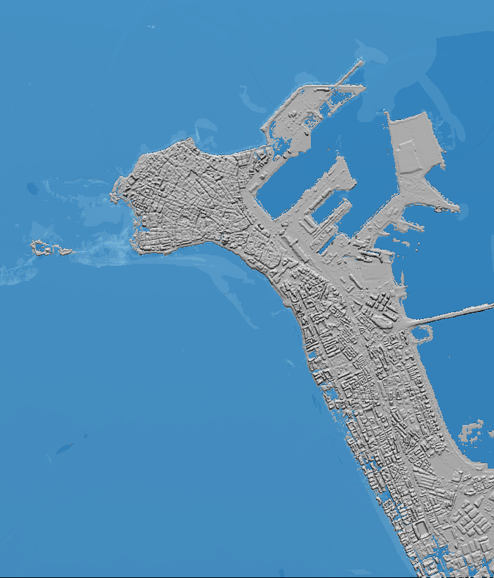
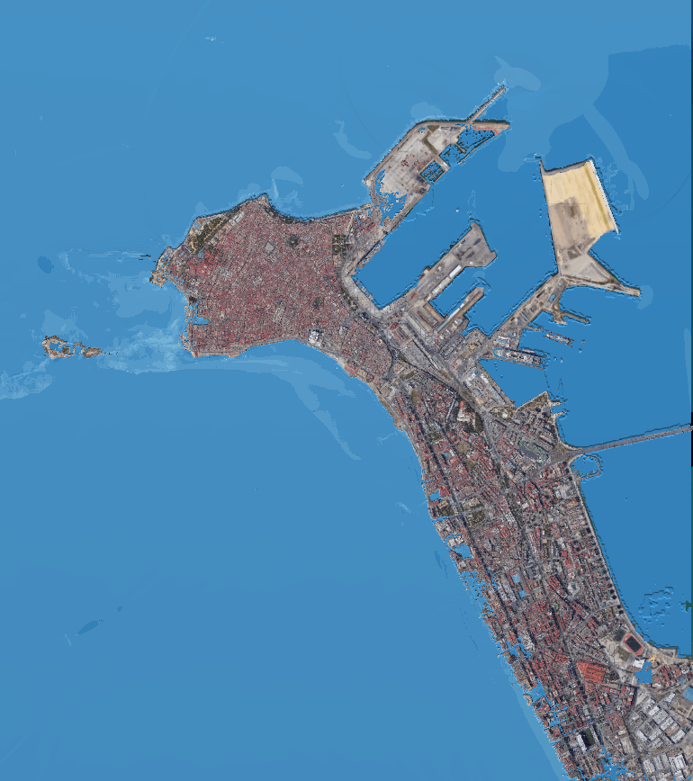
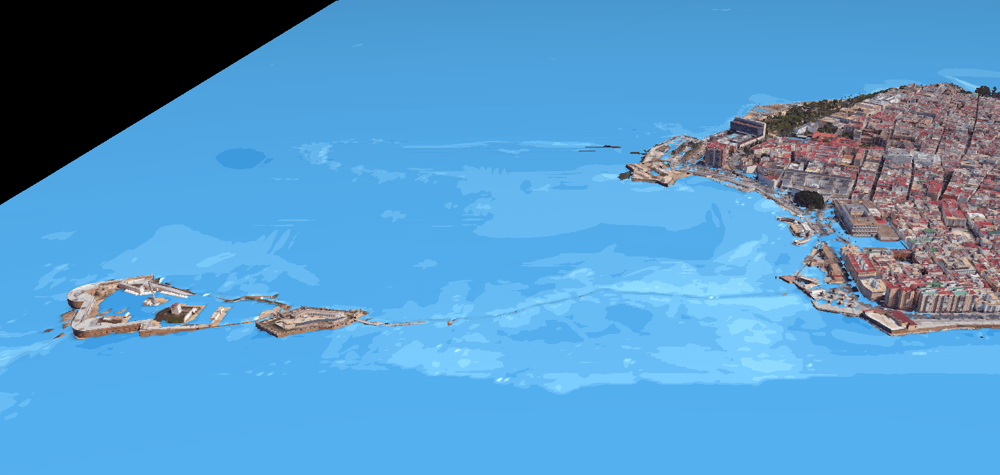
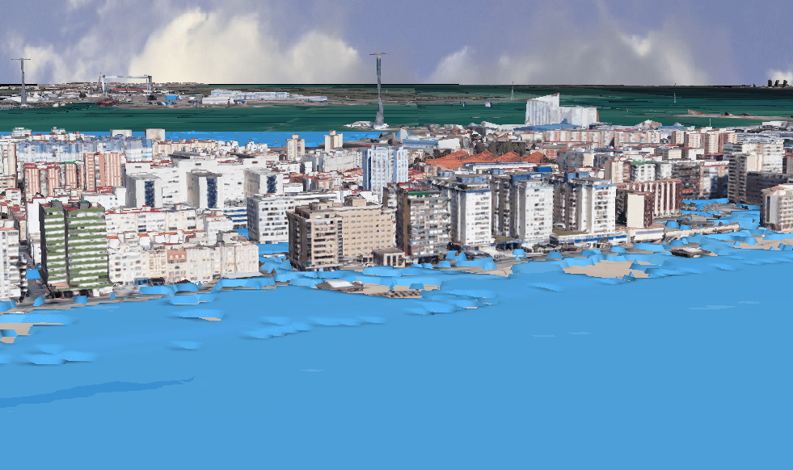

[headline]:<>

## Purpose

This module is designed to read [TsunamiHySEA](https://edanya.uma.es/hysea/index.php/models/tsunami-hysea) files. [TsunamiHySEA](https://edanya.uma.es/hysea/index.php/models/tsunami-hysea) is a numerical model for quake generated tsunami simulation. The raw data output of the simulation is a netCDF file which contains the following mandatory attributes:

- **lon**: Longitude array which specifies one dimension of the sea domain

- **lat**: Latitdude array which specifies one dimension of the sea domain

- **grid_lat**: Latitdude array of the topography

- **grid_lon**: Longitude array of the topography

- **time**: Timesteps used for the simulation

- **eta**: Wave amplitude per timestep

## How the reader works

The reader is able to read netCDF files which uses a [PnetCDF](https://parallel-netcdf.github.io/) supported file type. In general the module will fetch the longitude and latitude values for the sea (**lon**, **lat**) and the bathymetry (**grid_lon**, **grid_lat**) from the netCDF file. Based on each longitude-latitude pair the reader creates a 2D grid, varies the wave height (**eta** - orthogonal to longitude and latitude coordinates) per timestep and creates a 3D surface representing the sea surface out of it. If an attribute **bathymetry** is provided with the netCDF file the reader will build a ground surface as well. Additional attributes like scalar data will be mapped onto the sea surface.

---

## Ports
[moduleHtml]:<>

The first two ports output the geometry for the sea surface and bathymetry as an LayerGrid/Heightmap object. The other ports are providing a vistle scalar object which representing the corresponding in the parameter browser selected attributes.

[parameters]:<>

### Important to note

This module distributes the data into domain blocks per spawned mpi process. With the parameters **blocks latitude** and **blocks longitude** an user needs to specify the distribution of the simulation domain. The parameter **fill** enables the option to replace in the netCDF file used fillValues for the attribute **eta** with a new fillValue to reduce the height dimension of the sea surface. If **fill** is enabled an user need to specify the current fillValue with the parameter **fillValue** (default fillValue: -9999) along with the replacement with **fillValueNew**. A netCDF file read by this reader which does not contain a bathymetry attribute named with a string containing atleast the substring *"bathy"* won't get noticed as bathymetry data and therefore not providing output data for the second port. In this case the parameter browser will show **None** for the parameter **bathymetry**. Otherwise there will be a selection of bathymetry options available.

## Example Usage

### Simple cases

In the simplest and most cases a visualization of the simulation result can be done like shown in figure 1. 

```{figure} [vslFile]:<simple>
---
align: center
width: 150px
---
Fig 1: Simple vizualization pipeline.
```
In this example the second port will be used to visualize the topography. For the third port the additional scalar data **max_height** is selected which will directly mapped onto the sea surface. The following picture shows the result of executing this visualization pipeline.


### Cádiz Tsunami

Visualizing simulation data next to additional topographic data assumes that coordinates are set up for a specific coordinate system. In the next example google maps data of the city Cádiz is used to generate a more immersive experience in VR. In such an example the tsunami data needs to be converted into another coordinate system because google maps uses a certain type of map projection called Mercator. The figure 2 shows the visualization pipeline of this example. [MapDrape](MapDrape.md) is used in this context to make a coordinate system conversion of the dataset from WGS84 to Mercator. [IndexManifolds](IndexManifolds.md) needs to be used here to specify which layer of the LayerGrid needs to be used as input for MapDrape. [LoadCover](LoadCover.md) loads the google data as VRML file while the [Variant](Variant.md) modules allows the user to disable data later in COVER.

```{figure} [vslFile]:<cadiz>
---
align: center
width: 500px
---
Fig 2: Cádiz pipeline.
```
The first picture shows the result of executing the visualization pipeline from above with the topographic data which comes with the netCDF data.



In comparison to the previous topographic data the same simulation data with the additional google maps data is shown in the following pictures.







## Related Modules

### Often Used With

- [Color](Color.md)
- [MapDrape](MapDrape.md)
- [IndexManifolds](IndexManifolds.md)
- [Variant](Variant.md)

## Build Requirements

- PnetCDF: build with --enable-thread-safe flag as described on [PnetCDF-GitHub](https://github.com/Parallel-NetCDF/PnetCDF) or installed via packagemanager

:::{note}
The pnetcdf install directory should be added to your $PATH environment variable in order to be found by CMake, otherwise it won't be build.
:::

## Acknowledgements

- [TsunamiHySEA](https://github.com/edanya-uma/TsunamiHySEA)
- [ChEESE](https://cheese-coe.eu/)
- [Google Maps](https://www.google.com/maps/place/C%C3%A1diz,+Provinz+C%C3%A1diz,+Spanien/@36.5163851,-6.2999767,14z/data=!3m1!4b1!4m5!3m4!1s0xd0dd25724ec240f:0x40463fd8ca03b00!8m2!3d36.5210142!4d-6.2804565?hl=de)
